# OOP-LAB-4-24K-0762

# C++ Code Repository

## Preview
Here are the sample outputs of the programs:

### Task 1 Output:
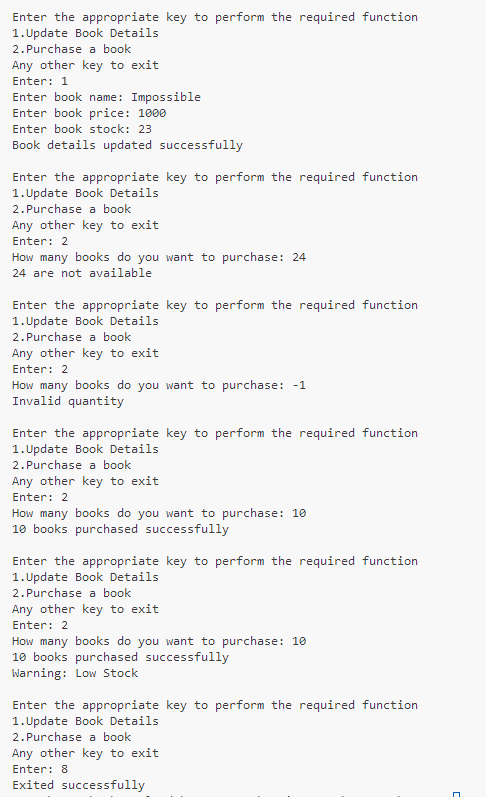

### Task 2 Output 1:
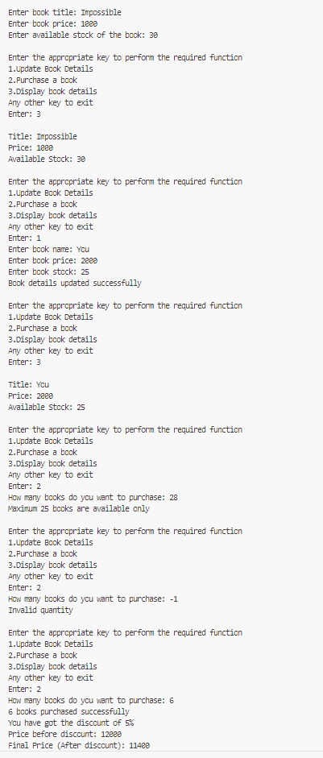

### Task 2 Output 2:
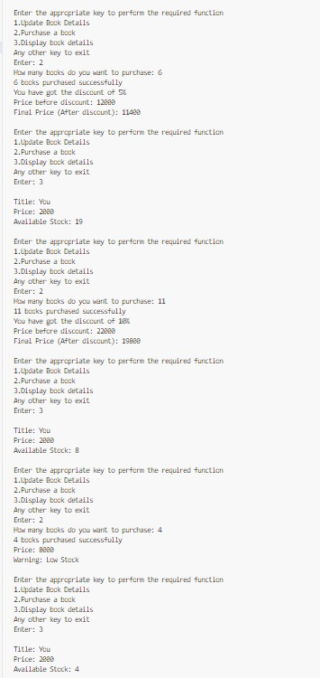

### Task 2 Output 3:
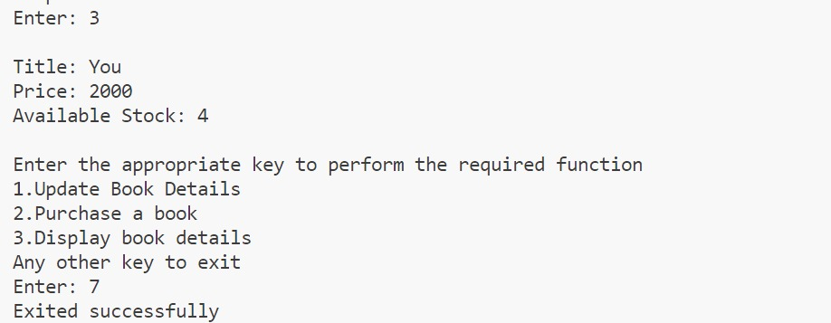

### Task 3 Output:
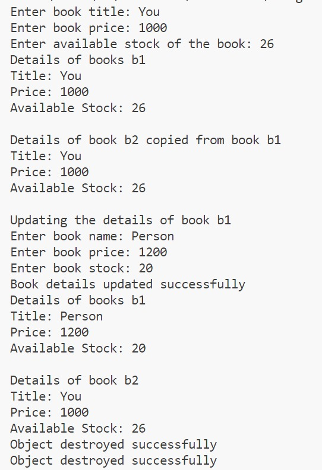

### Task 4 Output 1:
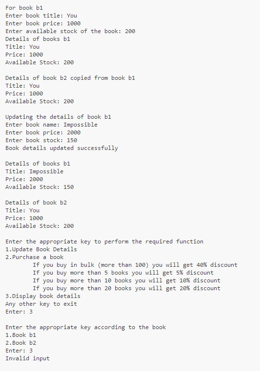

### Task 4 Output 2:
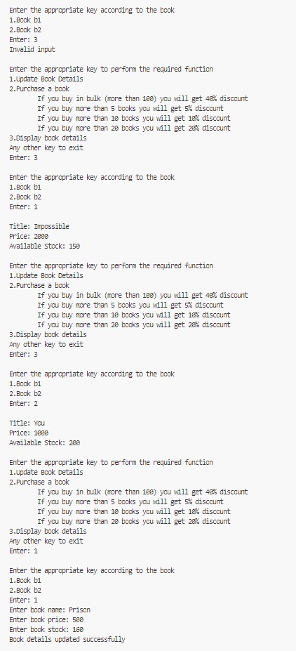

### Task 4 Output 3:
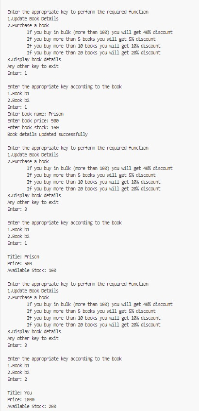

### Task 4 Output 4:
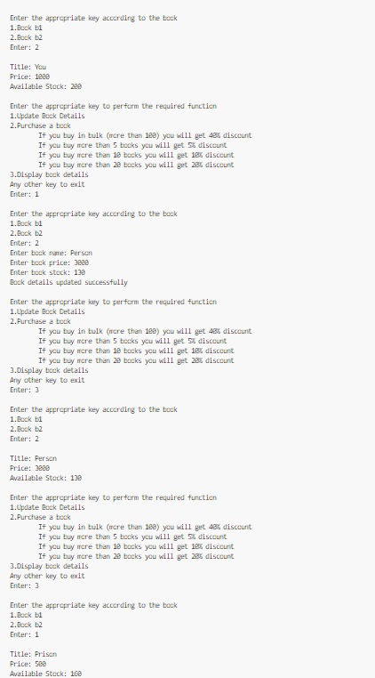

### Task 4 Output 5:
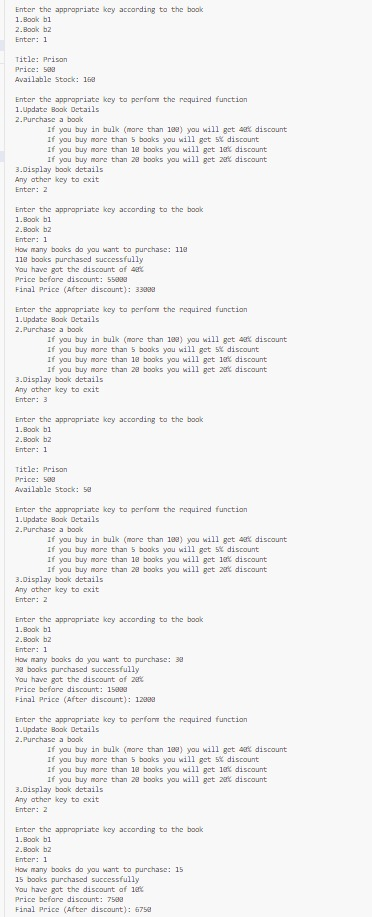

### Task 4 Output 6:
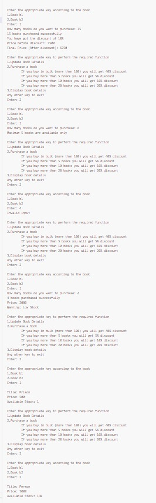

### Task 4 Output 7:
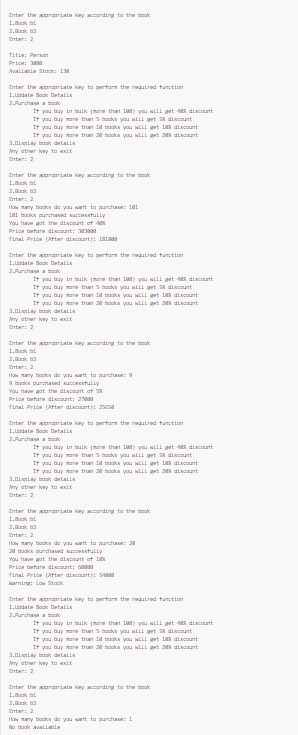

### Task 4 Output 8:
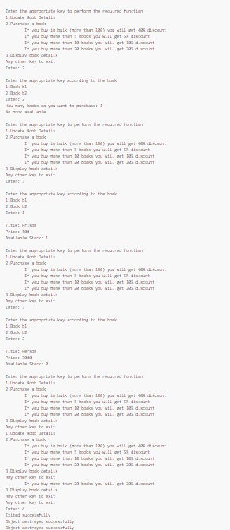


### Task 5 Output 1:
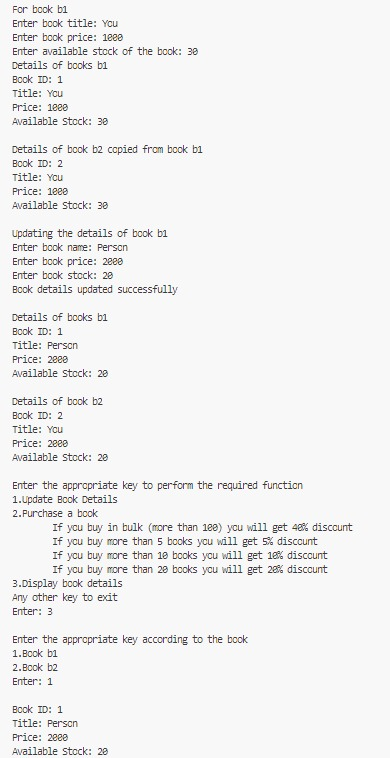

### Task 5 Output 2:
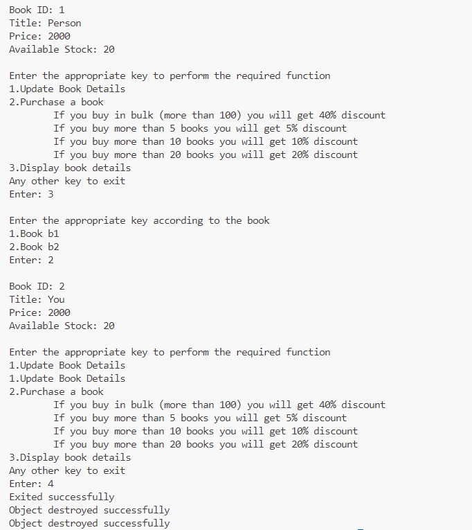


---

## Code
Below are the C++ programs:

### Program 1: 
```cpp
#include<iostream>
using namespace std;
class Book{
    string title;
    float price;
    int *stock=new int;
    public:
        Book(){
            title="Unknown";
            price=0.0;
            *stock=30;
        }
        void update_details(){
            cout<<"Enter book name: ";
            cin>>title;
            cout<<"Enter book price: ";
            cin>>price;
            cout<<"Enter book stock: ";
            cin>>*stock;
            cout<<"Book details updated successfully"<<endl;
        }
        void purchase_book(int qty){
            if(qty>=0){
                if(qty<=*stock){
                    *stock-=qty;
                    cout<<qty<<" books purchased successfully"<<endl;
                    if(*stock<5){
                        cout<<"Warning: Low Stock"<<endl;
                    }
                }
                else{
                    cout<<qty<<" are not available"<<endl;;
                }
            }
            else{
                cout<<"Invalid quantity"<<endl;
            }
        }
};
int main(){
    Book b1;
    int c,qty;
    while(1){
        cout<<"Enter the appropriate key to perform the required function\n1.Update Book Details\n2.Purchase a book\nAny other key to exit\nEnter: ";
        cin>>c;
        switch(c){
            case 1:
                b1.update_details();
;               break;
            case 2:
                cout<<"How many books do you want to purchase: ";
                cin>>qty;
                b1.purchase_book(qty);
                break;
            default:
                cout<<"Exited successfully";
                return 0;
        }
        cout<<endl;
    }
}


## Code
Below are the C++ programs:

### Program 2: 
```cpp
#include<iostream>
using namespace std;
class Book{
    string title;
    float price;
    int *stock=new int;
    public:
        Book(string title,float p,int s){
            this->title=title;
            price=p;
            *stock=s;
        }
        void update_details(){
            cout<<"Enter book name: ";
            cin>>title;
            cout<<"Enter book price: ";
            cin>>price;
            cout<<"Enter book stock: ";
            cin>>*stock;
            cout<<"Book details updated successfully"<<endl;
        }
        void applyDiscount(int qty,float p){
            if(qty>10){
                cout<<"You have got the discount of 10%"<<endl<<"Price before discount: "<<p*qty<<endl;
                p=(p*90)/100;
                cout<<"Final Price (After discount): "<<p*qty<<endl;
            }
            else{ 
                if(qty>5){
                    cout<<"You have got the discount of 5%"<<endl<<"Price before discount: "<<p*qty<<endl;
                    p=(p*95)/100;
                    cout<<"Final Price (After discount): "<<p*qty<<endl;
                }
                else{
                    cout<<"Price: "<<p*qty<<endl;
                }
            }
        }
        void purchase_book(int qty){
            if(qty>=0){
                if(*stock!=0){
                    if(qty<=*stock){
                        *stock-=qty;
                        cout<<qty<<" books purchased successfully"<<endl;
                        applyDiscount(qty,price);
                        if(*stock<5){
                            cout<<"Warning: Low Stock"<<endl;
                        }
                    }
                    else{
                        cout<<"Maximum "<<*stock<<" books are available only"<<endl;
                    }
                }
                else{
                    cout<<"No book available"<<endl;
                }
            }
            else{
                cout<<"Invalid quantity"<<endl;
            }
        }
        void display_book(){
            cout<<endl<<"Title: "<<title<<endl<<"Price: "<<price<<endl<<"Available Stock: "<<*stock<<endl;
        }
};
int main(){
    float price;
    string title;
    int stock;
    cout<<"Enter book title: ";
    cin>>title;
    cout<<"Enter book price: ";
    cin>>price;
    cout<<"Enter available stock of the book: ";
    cin>>stock;    
    Book b1(title,price,stock);
    int c,qty;
    while(1){
        cout<<endl<<"Enter the appropriate key to perform the required function\n1.Update Book Details\n2.Purchase a book\n3.Display book details\nAny other key to exit\nEnter: ";
        cin>>c;
        switch(c){
            case 1:
                b1.update_details();
                break;
            case 2:
                cout<<"How many books do you want to purchase: ";
                cin>>qty;
                b1.purchase_book(qty);
                break;
            case 3:
                b1.display_book();
                break;
            default:
                cout<<"Exited successfully";
                return 0;
        }
    }
}


## Code
Below are the C++ programs:

### Program 3: 
```cpp
#include<iostream>
using namespace std;
class Book{
    string title;
    float price;
    int *stock=new int;
    public:
        Book(string title,float p,int s){
            this->title=title;
            price=p;
            *stock=s;
        }
        Book(Book& obj){
            title=obj.title;
            price=obj.price;
            *stock=*obj.stock;
        }
        void update_details(){
            cout<<"Enter book name: ";
            cin>>title;
            cout<<"Enter book price: ";
            cin>>price;
            cout<<"Enter book stock: ";
            cin>>*stock;
            cout<<"Book details updated successfully"<<endl;
        }
        void applyDiscount(int qty,float p){
            if(qty>10){
                cout<<"You have got the discount of 10%"<<endl<<"Price before discount: "<<p*qty<<endl;
                p=(p*90)/100;
                cout<<"Final Price (After discount): "<<p*qty<<endl;
            }
            else{ 
                if(qty>5){
                    cout<<"You have got the discount of 5%"<<endl<<"Price before discount: "<<p*qty<<endl;
                    p=(p*95)/100;
                    cout<<"Final Price (After discount): "<<p*qty<<endl;
                }
                else{
                    cout<<"Price: "<<p*qty<<endl;
                }
            }
        }
        void purchase_book(int qty){
            if(qty>=0){
                if(*stock!=0){
                    if(qty<=*stock){
                        *stock-=qty;
                        cout<<qty<<" books purchased successfully"<<endl;
                        applyDiscount(qty,price);
                        if(*stock<5){
                            cout<<"Warning: Low Stock"<<endl;
                        }
                    }
                    else{
                        cout<<"Maximum "<<*stock<<" books are available only"<<endl;
                    }
                }
                else{
                    cout<<"No book available"<<endl;
                }
            }
            else{
                cout<<"Invalid quantity"<<endl;
            }
        }
        void display_book(){
            cout<<endl<<"Title: "<<title<<endl<<"Price: "<<price<<endl<<"Available Stock: "<<*stock<<endl;
        }
        ~Book(){
            cout<<"Object destroyed successfully"<<endl;
            delete stock;
        }
};
int main(){
    float price;
    string title;
    int stock;
    cout<<"Enter book title: ";
    cin>>title;
    cout<<"Enter book price: ";
    cin>>price;
    cout<<"Enter available stock of the book: ";
    cin>>stock;    
    Book b1(title,price,stock);
    Book b2=b1;
    cout<<"Details of books b1";
    b1.display_book();
    cout<<endl<<"Details of book b2 copied from book b1";
    b2.display_book();
    cout<<endl<<"Updating the details of book b1"<<endl;
    b1.update_details();
    cout<<"Details of books b1";
    b1.display_book();
    cout<<endl<<"Details of book b2";
    b2.display_book();
    return 0;
}


## Code
Below are the C++ programs:

### Program 4: 
```cpp

#include<iostream>
using namespace std;
class Book{
    string title;
    float *price=new float;
    int *stock=new int;
    public:
        Book(string title,float *price,int s){
            this->title=title;
            this->price=price;
            *stock=s;
        }
        Book(Book& obj){
            title=obj.title;
            *price=*obj.price;
            *stock=*obj.stock;
        }
        void update_details(){
            cout<<"Enter book name: ";
            cin>>title;
            cout<<"Enter book price: ";
            cin>>*price;
            cout<<"Enter book stock: ";
            cin>>*stock;
            cout<<"Book details updated successfully"<<endl;
        }
        void applyDiscount(int qty,float price){
            if(qty>100){
                cout<<"You have got the discount of 40%"<<endl<<"Price before discount: "<<price*qty<<endl;
                price=(price*60)/100;
                cout<<"Final Price (After discount): "<<price*qty<<endl;
            }
            else if(qty>20){
                cout<<"You have got the discount of 20%"<<endl<<"Price before discount: "<<price*qty<<endl;
                price=(price*80)/100;
                cout<<"Final Price (After discount): "<<price*qty<<endl;
            }
            else if(qty>10){
                cout<<"You have got the discount of 10%"<<endl<<"Price before discount: "<<price*qty<<endl;
                price=(price*90)/100;
                cout<<"Final Price (After discount): "<<price*qty<<endl;
            }
            else if(qty>5){
                cout<<"You have got the discount of 5%"<<endl<<"Price before discount: "<<price*qty<<endl;
                price=(price*95)/100;
                cout<<"Final Price (After discount): "<<price*qty<<endl;
            }
            else{
                cout<<"Price: "<<price*qty<<endl;
            }
        }
        void purchase_book(int qty){
            if(qty>=0){
                if(*stock!=0){
                    if(qty<=*stock){
                        *stock-=qty;
                        cout<<qty<<" books purchased successfully"<<endl;
                        applyDiscount(qty,*(this->price));
                        if(*stock<5){
                            cout<<"Warning: Low Stock"<<endl;
                        }
                    }
                    else{
                        cout<<"Maximum "<<*stock<<" books are available only"<<endl;
                    }
                }
                else{
                    cout<<"No book available"<<endl;
                }
            }
            else{
                cout<<"Invalid quantity"<<endl;
            }
        }
        void display_book(){
            cout<<endl<<"Title: "<<title<<endl<<"Price: "<<*price<<endl<<"Available Stock: "<<*stock<<endl;
        }
        ~Book(){
            cout<<"Object destroyed successfully"<<endl;
            delete stock;
            delete this->price;
        }
};
int main(){
    float price;
    string title;
    int stock,c1,c2,qty;
    cout<<"For book b1"<<endl;
    cout<<"Enter book title: ";
    cin>>title;
    cout<<"Enter book price: ";
    cin>>price;
    cout<<"Enter available stock of the book: ";
    cin>>stock;    
    Book b1(title,&price,stock);
    Book b2=b1;
    cout<<"Details of books b1";
    b1.display_book();
    cout<<endl<<"Details of book b2 copied from book b1";
    b2.display_book();
    cout<<endl<<"Updating the details of book b1"<<endl;
    b1.update_details();
    cout<<endl<<"Details of books b1";
    b1.display_book();
    cout<<endl<<"Details of book b2";
    b2.display_book();
    while(1){
        cout<<endl<<"Enter the appropriate key to perform the required function\n1.Update Book Details\n2.Purchase a book\n\tIf you buy in bulk (more than 100) you will get 40% discount\n\tIf you buy more than 5 books you will get 5% discount\n\tIf you buy more than 10 books you will get 10% discount\n\tIf you buy more than 20 books you will get 20% discount\n3.Display book details\nAny other key to exit\nEnter: ";
        cin>>c1;
        switch(c1){
            case 1:
                cout<<endl<<"Enter the appropriate key according to the book\n1.Book b1\n2.Book b2\nEnter: ";
                cin>>c2;
                if(c2==1){
                    b1.update_details();
                }
                else if(c2==2){
                    b2.update_details();
                }
                else{
                    cout<<"Invalid input"<<endl;
                }
                break;
            case 2:
                cout<<endl<<"Enter the appropriate key according to the book\n1.Book b1\n2.Book b2\nEnter: ";
                cin>>c2;
                if(c2==1){
                    cout<<"How many books do you want to purchase: ";
                    cin>>qty;
                    b1.purchase_book(qty);
                }
                else if(c2==2){
                    cout<<"How many books do you want to purchase: ";
                    cin>>qty;
                    b2.purchase_book(qty);
                }
                else{
                    cout<<"Invalid input"<<endl;
                }
                break;
            case 3:
                cout<<endl<<"Enter the appropriate key according to the book\n1.Book b1\n2.Book b2\nEnter: ";
                cin>>c2;
                if(c2==1){
                    b1.display_book();
                    break;
                }
                else if(c2==2){
                    b2.display_book();
                }
                else{
                    cout<<"Invalid input"<<endl;
                }
                break;
            default:
                cout<<"Exited successfully"<<endl;
                return 0;
        }
    }
}


## Code
Below are the C++ programs:

### Program 5: 
```cpp

#include<iostream>
using namespace std;
class Book{
    string title;
    float *price=new float;
    int *stock=new int,BookID;
    static int counter;
    public:
        Book(string t,float *p,int *s): BookID(counter++),title(t),price(p),stock(s){}
        Book(Book& obj):BookID(counter++),title(obj.title),price(obj.price),stock(obj.stock){}
        void update_details(){
            cout<<"Enter book name: ";
            cin>>title;
            cout<<"Enter book price: ";
            cin>>*price;
            cout<<"Enter book stock: ";
            cin>>*stock;
            cout<<"Book details updated successfully"<<endl;
        }
        void applyDiscount(int qty,float price){
            if(qty>100){
                cout<<"You have got the discount of 40%"<<endl<<"Price before discount: "<<price*qty<<endl;
                price=(price*60)/100;
                cout<<"Final Price (After discount): "<<price*qty<<endl;
            }
            else if(qty>20){
                cout<<"You have got the discount of 20%"<<endl<<"Price before discount: "<<price*qty<<endl;
                price=(price*80)/100;
                cout<<"Final Price (After discount): "<<price*qty<<endl;
            }
            else if(qty>10){
                cout<<"You have got the discount of 10%"<<endl<<"Price before discount: "<<price*qty<<endl;
                price=(price*90)/100;
                cout<<"Final Price (After discount): "<<price*qty<<endl;
            }
            else if(qty>5){
                cout<<"You have got the discount of 5%"<<endl<<"Price before discount: "<<price*qty<<endl;
                price=(price*95)/100;
                cout<<"Final Price (After discount): "<<price*qty<<endl;
            }
            else{
                cout<<"Price: "<<price*qty<<endl;
            }
        }
        void purchase_book(int qty){
            if(qty>=0){
                if(*stock!=0){
                    if(qty<=*stock){
                        *stock-=qty;
                        cout<<qty<<" books purchased successfully"<<endl;
                        applyDiscount(qty,*(this->price));
                        if(*stock<5){
                            cout<<"Warning: Low Stock"<<endl;
                        }
                    }
                    else{
                        cout<<"Maximum "<<*stock<<" books are available only"<<endl;
                    }
                }
                else{
                    cout<<"No book available"<<endl;
                }
            }
            else{
                cout<<"Invalid quantity"<<endl;
            }
        }
        void display_book(){
            cout<<endl<<"Book ID: "<<BookID<<endl<<"Title: "<<title<<endl<<"Price: "<<*price<<endl<<"Available Stock: "<<*stock<<endl;
        }
        ~Book(){
            cout<<"Object destroyed successfully"<<endl;
            delete stock;
            delete this->price;
        }
};
int Book::counter=1;
int main(){
    float price;
    string title;
    int stock,c1,c2,qty;
    cout<<"For book b1"<<endl;
    cout<<"Enter book title: ";
    cin>>title;
    cout<<"Enter book price: ";
    cin>>price;
    cout<<"Enter available stock of the book: ";
    cin>>stock;    
    Book b1(title,&price,&stock);
    Book b2=b1;
    cout<<"Details of books b1";
    b1.display_book();
    cout<<endl<<"Details of book b2 copied from book b1";
    b2.display_book();
    cout<<endl<<"Updating the details of book b1"<<endl;
    b1.update_details();
    cout<<endl<<"Details of books b1";
    b1.display_book();
    cout<<endl<<"Details of book b2";
    b2.display_book();
    while(1){
        cout<<endl<<"Enter the appropriate key to perform the required function\n1.Update Book Details\n2.Purchase a book\n\tIf you buy in bulk (more than 100) you will get 40% discount\n\tIf you buy more than 5 books you will get 5% discount\n\tIf you buy more than 10 books you will get 10% discount\n\tIf you buy more than 20 books you will get 20% discount\n3.Display book details\nAny other key to exit\nEnter: ";
        cin>>c1;
        switch(c1){
            case 1:
                cout<<endl<<"Enter the appropriate key according to the book\n1.Book b1\n2.Book b2\nEnter: ";
                cin>>c2;
                if(c2==1){
                    b1.update_details();
                }
                else if(c2==2){
                    b2.update_details();
                }
                else{
                    cout<<"Invalid input"<<endl;
                }
                break;
            case 2:
                cout<<endl<<"Enter the appropriate key according to the book\n1.Book b1\n2.Book b2\nEnter: ";
                cin>>c2;
                if(c2==1){
                    cout<<"How many books do you want to purchase: ";
                    cin>>qty;
                    b1.purchase_book(qty);
                }
                else if(c2==2){
                    cout<<"How many books do you want to purchase: ";
                    cin>>qty;
                    b2.purchase_book(qty);
                }
                else{
                    cout<<"Invalid input"<<endl;
                }
                break;
            case 3:
                cout<<endl<<"Enter the appropriate key according to the book\n1.Book b1\n2.Book b2\nEnter: ";
                cin>>c2;
                if(c2==1){
                    b1.display_book();
                    break;
                }
                else if(c2==2){
                    b2.display_book();
                }
                else{
                    cout<<"Invalid input"<<endl;
                }
                break;
            default:
                cout<<"Exited successfully"<<endl;
                return 0;
        }
    }    
}


 
